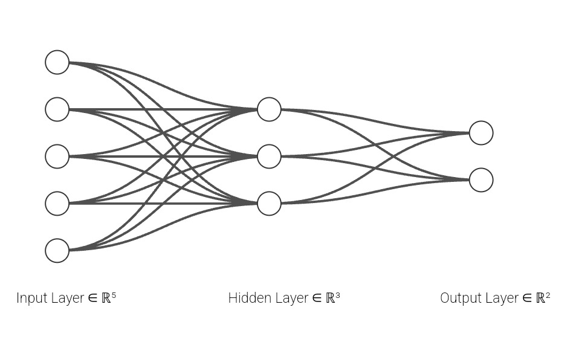

# fastNeuralNetwork
Fast Neural Network from base using only numpy, numba, cupy, C++, without TensorFlow and PyTorch, in just one page of code

Everything is in front of you, just with a look:


Fast neural network from scratch using only tools like NumPy, Numba, CuPy, and C++ offers several benefits:

1. **Full Control**: You have complete control over the architecture and optimization, allowing for custom modifications that go beyond the standard features of frameworks like TensorFlow and PyTorch.

2. **Performance Optimization**: By using low-level tools and parallelization libraries like Numba and CuPy, you can optimize the neural network for specific hardware, potentially achieving faster execution times than higher-level libraries.

3. **Lightweight Code**: Implementing the neural network in just one page of code keeps the project simple and easy to maintain, reducing overhead and complexity.

4. **Educational Value**: Building a neural network from scratch enhances understanding of fundamental concepts and operations, which is often abstracted away by high-level frameworks.

5. **Dependency-Free**: Avoiding large frameworks minimizes external dependencies, making the code more portable and easier to deploy in environments with limited resources.

Artificial neural network applications are often programmed using TensorFlow and similar modules. When programming with these modules, only high-level commands are visible, and the details of the underlying processes are not apparent. Few people truly understand what a neural network is, as most are only programming with high-level languages.
For many years, the process by which the brain learns remained a mystery. **The primary mechanism of learning in the brain is through the adjustment of synaptic weights at the connections between neurons.** These synaptic weights determine the strength of the signal transmitted from one neuron to another. 

When we learn something new, neural pathways are either strengthened or weakened based on the frequency and intensity of the signals passing through them. This process is known as synaptic plasticity. The more a particular pathway is used, the stronger the connections become, making the signal transmission more efficient. Conversely, pathways that are rarely used may weaken over time.

This mechanism is crucial for various types of learning and memory formation, enabling the brain to adapt and reorganize itself in response to new information, experiences, and even injury. By understanding these processes, researchers can develop more effective artificial neural networks and enhance our comprehension of human cognition and neural disorders.

**The main formula behind the neural connections in the brain that facilitate learning can be expressed as:**

$$
 \text{Output} = w \cdot \text{input} + \text{bias} 
$$


1. **Input**: This represents the signal received by a neuron from other neurons.
2. **Weight (w)**: This is a parameter that adjusts the strength of the input signal. Each connection between neurons has a weight that can increase or decrease the signal's impact.
3. **Bias**: This is an additional parameter that allows the neuron to shift the output function, providing greater flexibility in the learning process.

When a neuron receives inputs, each input is multiplied by its corresponding weight. The sum of these weighted inputs is then added to the bias. The resulting value determines the neuron's output, which can then be passed to other neurons.

In essence, learning occurs through the adjustment of these weights and biases. By modifying them, the neural network can better match inputs to desired outputs, improving its performance over time. This adjustment process is known as training in artificial neural networks and synaptic plasticity in biological brains.

The brain contains approximately 85 billion neurons, which form an immense number of connections, each with its own weights and biases. This complex network allows for highly efficient learning.


1. **Neurons**: The brain's basic functional units are neurons. Each neuron can connect to thousands of other neurons, forming a vast network.
2. **Connections (Synapses)**: These connections, or synapses, are where learning occurs. Each synapse has a weight and a bias.
3. **Weights**: Weights determine the strength or importance of the input signals. Adjusting these weights allows the brain to prioritize certain signals over others.
4. **Biases**: Biases help fine-tune the output of neurons, making the neural network more adaptable and responsive.

When the brain learns, it adjusts the weights and biases of these connections based on experiences and information. This process is dynamic and ongoing, enabling the brain to continuously adapt and optimize its performance. The sheer number of neurons and connections creates a highly sophisticated and flexible system capable of complex thought, learning, and memory formation.

The brain can be conceptualized as a highly complex function that takes multiple inputs (x1, x2, ..., xn) and produces multiple outputs (y1, y2, ..., ym). This function, F, involves a vast network of interconnected neurons, each with its own weights and biases. These weights and biases are adjusted through learning processes to map inputs to desired outputs.

Formally, this can be described as:

$$ (y1, y2, ..., ym) = F(x1, x2, ..., xn) $$

The function \( F \) represents the combined effect of many neurons, each applying a weighted sum of inputs plus a bias, followed by an activation function. This process can be incredibly complex, **involving billions of parameters (weights and biases), making the brain's mapping function analogous to a polynomial of a very high order, possibly in the range of billions.**

In neural network terms, this can be broken down as follows:

1. **Inputs (x1, x2, ..., xn):** Sensory or other types of data received by the brain.
2. **Weights and biases:** Parameters that are adjusted through learning to improve the accuracy of the function \( F \).
3. **Activation function:** A nonlinear function applied to the weighted sum of inputs to introduce nonlinearity into the model, allowing it to capture more complex patterns.
4. **Outputs (y1, y2, ..., ym):** The resulting actions, thoughts, or other responses generated by the brain.

This intricate process allows the brain to perform a wide array of tasks, from simple reflexes to complex problem-solving and decision-making.

# simple Neural Network example 

Let's break down the brain's function with a simplified neural network example, using the given inputs, neurons, and outputs. We'll consider a neural network with one hidden layer for simplicity:



#### Inputs and Neurons

- **Inputs (x):** \( x1, x2, x3, x4, x5 \)
- **Neurons in Hidden Layer 1 (h):** 3 neurons
- **Outputs (y):** \( y1, y2 \)

#### Structure of the Neural Network

1. **Input Layer:** 5 inputs.
2. **Hidden Layer:** 3 neurons.
3. **Output Layer:** 2 outputs.

#### Weights and Biases

- **Weights between Input Layer and Hidden Layer:** 

$$ W_{1} = \begin{bmatrix}
  w_{11} & w_{12} & w_{13} \\
  w_{21} & w_{22} & w_{23} \\
  w_{31} & w_{32} & w_{33} \\
  w_{41} & w_{42} & w_{43} \\
  w_{51} & w_{52} & w_{53}
  \end{bmatrix} $$
  
  Here, \( W1 \) is a 5x3 matrix (5 inputs, 3 neurons in the hidden layer).

- **Biases for Hidden Layer:**

$$ b_{1} = \begin{bmatrix}
  b_{11} \\
  b_{12} \\
  b_{13}
  \end{bmatrix} $$
  
  Here, \( b1 \) is a 3x1 vector (one bias per hidden neuron).

- **Weights between Hidden Layer and Output Layer:**

$$ W_{2} = \begin{bmatrix}
  w_{h1y1} & w_{h1y2} \\
  w_{h2y1} & w_{h2y2} \\
  w_{h3y1} & w_{h3y2}
  \end{bmatrix} $$
  
  Here, \( W2 \) is a 3x2 matrix (3 neurons in the hidden layer, 2 outputs).

- **Biases for Output Layer:**

$$ b_{2} = \begin{bmatrix}
  b_{21} \\
  b_{22}
  \end{bmatrix} $$
  
  Here, \( b2 \) is a 2x1 vector (one bias per output neuron).

#### Calculating the Output

1. **Hidden Layer Activation:**

$$ h = f(W_{1} \cdot x + b_{1}) $$

   Where \( x \) is the input vector:
   
   $$ \begin{bmatrix} x_1 & x_2 & x_3 & x_4 & x_5 \end{bmatrix}^T $$
   
   and \( f \) is the activation function (e.g., ReLU, sigmoid).

3. **Output Layer Activation:**

$$ y = g(W_{2} \cdot h + b_{2}) $$

   Where \( h \) is the hidden layer output vector and \( g \) is the activation function for the output layer (often softmax for classification or linear for regression).

#### Number of Weights and Biases

- **Weights between Input and Hidden Layer:**

 $$ 5 \text{ inputs} \times 3 \text{ neurons} = 15 \text{ weights} $$
  
- **Biases for Hidden Layer:**

 $$ 3 \text{ biases} $$
 
- **Weights between Hidden and Output Layer:**

 $$ 3 \text{ neurons} \times 2 \text{ outputs} = 6 \text{ weights} $$
 
- **Biases for Output Layer:**

 $$ 2 \text{ biases} $$

**Total Weights and Biases:**

$$ 15 + 3 + 6 + 2 = 26 \text{ parameters} $$

Here’s the code with TensorFlow module to define, compile, and summarize the neural network model as described `simpleNN_TF.ipynb`:

```python
import tensorflow as tf
from tensorflow.keras.models import Sequential
from tensorflow.keras.layers import Dense

# Define the model
model = Sequential([
    Dense(3, input_shape=(5,), activation='relu', name='hidden_layer'),  # Hidden layer with 3 neurons
    Dense(2, activation='linear', name='output_layer')  # Output layer with 2 neurons
])

# Compile the model
model.compile(optimizer='adam', loss='mean_squared_error')

# Print the model summary
model.summary()
```

- **Model Definition:** A `Sequential` model is used with two `Dense` layers:
  - The first `Dense` layer has 3 neurons, uses ReLU activation, and takes an input shape of 5 (for the 5 input features).
  - The second `Dense` layer has 2 neurons with a linear activation function for the output.
  
- **Compile:** The model is compiled with the Adam optimizer and mean squared error loss function.

- **Summary:** `model.summary()` prints the model architecture, including the number of parameters and layer details.

**Parameters saved in a neural network model, such as weights and biases, are analogous to the synaptic strengths in the brain.** These parameters define the mapping function \( F \) that transforms the inputs \( (x1, x2, x3, x4, x5) \) to the outputs \( (y1, y2) \). This transformation can be thought of as a complex polynomial function.

In summary:

**The neural network model parameters (weights and biases) function similarly to the synapses in the brain.** They define a mapping function \( F \) such that:

$$ (y1, y2) = F(x1, x2, x3, x4, x5) $$

This function \( F \) represents the intricate polynomial-like transformations performed by the network to produce the desired outputs from given inputs.

Let's break down the output calculation from the neural network into a form that explicitly shows the linear combination of inputs with their respective weights and biases. For simplicity, I'll provide a direct calculation for \( y1 \) and \( y2 \) based on the hidden layer activations and weights.

#### Given:
1. **Inputs (x):**

$$ \( x_1, x_2, x_3, x_4, x_5 \) $$

3. **Weights and biases for the hidden layer (from the input to hidden layer):**

$$ W_1 = \begin{bmatrix}
   w_{11} & w_{12} & w_{13} \\
   w_{21} & w_{22} & w_{23} \\
   w_{31} & w_{32} & w_{33} \\
   w_{41} & w_{42} & w_{43} \\
   w_{51} & w_{52} & w_{53}
   \end{bmatrix} $$
   
$$ b_1 = \begin{bmatrix}
   b_{11} \\
   b_{12} \\
   b_{13}
   \end{bmatrix} $$

4. **Weights and biases for the output layer (from the hidden layer to the output layer):**

$$ W_2 = \begin{bmatrix}
   w_{h1y1} & w_{h1y2} \\
   w_{h2y1} & w_{h2y2} \\
   w_{h3y1} & w_{h3y2}
   \end{bmatrix} $$

$$ b_2 = \begin{bmatrix}
   b_{21} \\
   b_{22}
   \end{bmatrix} $$

#### Hidden Layer Activations:
Let \( h1, h2, h3 \) be the activations of the hidden layer neurons. These are calculated as:

$$ h_1 = f(w_{11}x_1 + w_{21}x_2 + w_{31}x_3 + w_{41}x_4 + w_{51}x_5 + b_{11}) $$

$$ h_2 = f(w_{12}x_1 + w_{22}x_2 + w_{32}x_3 + w_{42}x_4 + w_{52}x_5 + b_{12}) $$

$$ h_3 = f(w_{13}x_1 + w_{23}x_2 + w_{33}x_3 + w_{43}x_4 + w_{53}x_5 + b_{13}) $$

where \( f \) is the activation function (e.g., ReLU).

#### Output Layer Calculations:
Using the hidden layer activations, the outputs \( y1 \) and \( y2 \) are computed as:

$$ y_1 = w_{h1y1}h_1 + w_{h2y1}h_2 + w_{h3y1}h_3 + b_{21} $$

$$ y_2 = w_{h1y2}h_1 + w_{h2y2}h_2 + w_{h3y2}h_3 + b_{22} $$

Substituting the hidden layer activations into these equations:

$$ y_1 = w_{h1y1} \cdot f(w_{11}x_1 + w_{21}x_2 + w_{31}x_3 + w_{41}x_4 + w_{51}x_5 + b_{11}) + w_{h2y1} \cdot f(w_{12}x_1 + w_{22}x_2 + w_{32}x_3 + w_{42}x_4 + w_{52}x_5 + b_{12}) + w_{h3y1} \cdot f(w_{13}x_1 + w_{23}x_2 + w_{33}x_3 + w_{43}x_4 + w_{53}x_5 + b_{13}) + b_{21} $$

$$ y_2 = w_{h1y2} \cdot f(w_{11}x_1 + w_{21}x_2 + w_{31}x_3 + w_{41}x_4 + w_{51}x_5 + b_{11}) + w_{h2y2} \cdot f(w_{12}x_1 + w_{22}x_2 + w_{32}x_3 + w_{42}x_4 + w_{52}x_5 + b_{12}) + w_{h3y2} \cdot f(w_{13}x_1 + w_{23}x_2 + w_{33}x_3 + w_{43}x_4 + w_{53}x_5 + b_{13}) + b_{22} $$

#### Simplified Form:
For clarity, if we assume \( f \) is an identity function (no activation), the equations reduce to:

$$ y_1 = w_{h1y1}(w_{11}x_1 + w_{21}x_2 + w_{31}x_3 + w_{41}x_4 + w_{51}x_5 + b_{11}) + w_{h2y1}(w_{12}x_1 + w_{22}x_2 + w_{32}x_3 + w_{42}x_4 + w_{52}x_5 + b_{12}) + w_{h3y1}(w_{13}x_1 + w_{23}x_2 + w_{33}x_3 + w_{43}x_4 + w_{53}x_5 + b_{13}) + b_{21} $$

$$ y_2 = w_{h1y2}(w_{11}x_1 + w_{21}x_2 + w_{31}x_3 + w_{41}x_4 + w_{51}x_5 + b_{11}) + w_{h2y2}(w_{12}x_1 + w_{22}x_2 + w_{32}x_3 + w_{42}x_4 + w_{52}x_5 + b_{12}) + w_{h3y2}(w_{13}x_1 + w_{23}x_2 + w_{33}x_3 + w_{43}x_4 + w_{53}x_5 + b_{13}) + b_{22} $$

These equations show how the outputs \( y1 \) and \( y2 \) are calculated as linear combinations of the inputs, with weights and biases playing the role of parameters in this complex mapping function. In the brain, this function is very complex, resembling a high-order polynomial mapping. Since we have established the creation of the neural network, it is now time to train and test the simple neural network with TensorFlow module:

```python
import tensorflow as tf
from tensorflow.keras.models import Sequential
from tensorflow.keras.layers import Dense
from tensorflow.keras.optimizers import Adam
import numpy as np

# Define the model
model = Sequential([
    Dense(3, input_shape=(5,), activation='relu', name='hidden_layer'),  # Hidden layer with 3 neurons
    Dense(2, activation='linear', name='output_layer')  # Output layer with 2 neurons
])

# Compile the model
model.compile(optimizer=Adam(), loss='mean_squared_error')

# Generate some dummy data for training and testing
# Inputs (features)
X_train = np.random.rand(1000, 5)
X_test = np.random.rand(200, 5)

# Outputs (targets)
y_train = np.random.rand(1000, 2)
y_test = np.random.rand(200, 2)

# Train the model
model.fit(X_train, y_train, epochs=10, batch_size=32, validation_data=(X_test, y_test))

# Evaluate the model
loss = model.evaluate(X_test, y_test)
print(f'Test loss: {loss}')

# Print the model summary
model.summary()
```

1. **Model Definition:**
   - A `Sequential` model with a hidden layer of 3 neurons (ReLU activation) and an output layer of 2 neurons (linear activation).

2. **Compilation:**
   - The model is compiled with the Adam optimizer and mean squared error loss function.

3. **Data Generation:**
   - Dummy data for training and testing is generated using NumPy. The training set has 1000 samples, and the test set has 200 samples, each with 5 features.

4. **Training:**
   - The model is trained for 10 epochs with a batch size of 32. Validation data is also provided for testing during training.

5. **Evaluation:**
   - The model is evaluated on the test set, and the test loss is printed.

6. **Model Summary:**
   - The model summary is printed, showing the architecture and parameters.

This completes the process of creating, training, and testing the simple neural network with TensorFlow module. In continuation, this simple neural network will be created, trained, and tested using numpy, numba, cupy, and C++. The benefits of these modules include higher speed compared to TensorFlow and PyTorch, and the ability to implement it with fewer lines of code in a single Python file.

# Neural Network with Numpy

Because TensorFlow is a high-level programming module that abstracts much of the underlying processes, it can be difficult to see what happens behind the scenes. Therefore, to understand the underlying mechanics, we can use a basic implementation with NumPy. This approach will help clarify the operations involved in a neural network, including the forward pass, backpropagation, and parameter updates.

### Steps to Understand Neural Network Operations with NumPy

1. **Initialize Parameters:**
   - Initialize weights and biases for the input-to-hidden and hidden-to-output layers with small random values.

2. **Forward Pass:**
   - Compute the activations of the hidden layer using the input data, weights, and biases.
   - Apply an activation function (e.g., ReLU) to the hidden layer.
   - Compute the output layer activations using the hidden layer activations, weights, and biases.
   - Apply the final activation function (e.g., linear or softmax) to obtain the final outputs.

3. **Loss Calculation:**
   - Compute the loss using a suitable loss function (e.g., mean squared error for regression tasks).

4. **Backpropagation:**
   - Compute the gradients of the loss with respect to the weights and biases in both the hidden and output layers.
   - Use the chain rule to propagate these gradients backward through the network.

5. **Parameter Updates:**
   - Update the weights and biases using gradient descent or another optimization algorithm, based on the computed gradients.

6. **Training Loop:**
   - Iterate through multiple epochs of forward passes, loss calculation, backpropagation, and parameter updates.
   - Optionally, include validation steps to monitor the network's performance on a separate dataset.

By following these steps with a basic NumPy implementation, one can gain a deeper understanding of the fundamental operations involved in training and testing a neural network.

Here is a code for creating, training, and testing a simple neural network using only NumPy, as previously explained.

Neural Network Implementation with NumPy `simpleNN_num.py`:

```
import numpy as np

# Helper functions
def relu(x):
    return np.maximum(0, x)

def relu_derivative(x):
    return np.where(x > 0, 1, 0)

def softmax(x):
    exp_x = np.exp(x - np.max(x, axis=1, keepdims=True))
    return exp_x / exp_x.sum(axis=1, keepdims=True)

def cross_entropy_loss(y_true, y_pred):
    n_samples = y_true.shape[0]
    logp = -np.log(y_pred[range(n_samples), y_true])
    loss = np.sum(logp) / n_samples
    return loss

def cross_entropy_loss_derivative(y_true, y_pred):
    grad = y_pred.copy()
    n_samples = y_true.shape[0]
    grad[range(n_samples), y_true] -= 1
    grad = grad / n_samples
    return grad

# Data
np.random.seed(0)
X = np.random.rand(100, 5)
y = np.random.randint(2, size=100)

# Network parameters
input_size = 5
hidden_size = 3
output_size = 2
learning_rate = 0.01
epochs = 1000

# Initialize weights and biases
W1 = np.random.randn(input_size, hidden_size)
b1 = np.zeros((1, hidden_size))
W2 = np.random.randn(hidden_size, output_size)
b2 = np.zeros((1, output_size))

# Training loop
for epoch in range(epochs):
    # Forward pass
    z1 = np.dot(X, W1) + b1
    a1 = relu(z1)
    z2 = np.dot(a1, W2) + b2
    a2 = softmax(z2)
    
    # Compute loss
    loss = cross_entropy_loss(y, a2)
    
    # Backpropagation
    grad_z2 = cross_entropy_loss_derivative(y, a2)
    grad_W2 = np.dot(a1.T, grad_z2)
    grad_b2 = np.sum(grad_z2, axis=0, keepdims=True)
    
    grad_a1 = np.dot(grad_z2, W2.T)
    grad_z1 = grad_a1 * relu_derivative(z1)
    grad_W1 = np.dot(X.T, grad_z1)
    grad_b1 = np.sum(grad_z1, axis=0, keepdims=True)
    
    # Update weights and biases
    W2 -= learning_rate * grad_W2
    b2 -= learning_rate * grad_b2
    W1 -= learning_rate * grad_W1
    b1 -= learning_rate * grad_b1
    
    if epoch % 100 == 0:
        print(f'Epoch {epoch}, Loss: {loss}')

# Evaluate the model
def predict(X):
    z1 = np.dot(X, W1) + b1
    a1 = relu(z1)
    z2 = np.dot(a1, W2) + b2
    a2 = softmax(z2)
    return np.argmax(a2, axis=1)

# Predictions
predictions = predict(X)
accuracy = np.mean(predictions == y)
print(f'Accuracy: {accuracy}')
```

# Neural Network with Numba

This script demonstrates the creation, training, and testing of a simple neural network using Numba. The code is designed to be faster than using NumPy alone.

Neural Network Implementation with Numba is present at `simpleNN_numba.py`.

# Neural Network with CuPy (CUDA GPU)

This script demonstrates the creation, training, and testing of a simple neural network using CuPy. The code is designed to be faster than using Numba alone.

Neural Network Implementation with CuPy is present at `simpleNN_cu.py`.

# Neural Network with C++

This script demonstrates the creation, training, and testing of a simple neural network using C++. The code is designed to be faster than using Python.

Neural Network Implementation with C++ is present at `simpleNN.cpp`.

# Projects

`MNIST_Class`: AI, image classifying MLP neural network and handwriting digits recognition using MNIST datasets only with numpy, numba, cupy, C++ and etc without TensorFlow and PyTorch.

The main difference between a typical convolutional neural network (CNN) with layers like `Conv2D`, `MaxPooling`, `Flatten`, and `Dense`, and a fully connected neural network (also known as a multi-layer perceptron, MLP) that only consists of `Dense` layers without `Conv2D`, `MaxPooling`, and `Flatten`, lies in their structure and how they process data.

### 1. **Convolutional Neural Network (CNN) Structure:**
   - **Conv2D Layers:** These layers apply convolutional filters to the input data (usually images). They help in capturing spatial features like edges, textures, and patterns by sliding the filters across the image. Each filter produces a feature map.
   - **MaxPooling Layers:** These layers reduce the spatial dimensions (height and width) of the feature maps, making the model more computationally efficient and helping to retain the most important features. This reduces the overall size of the data while preserving the features detected by the convolutional layers.
   - **Flatten Layer:** After the convolutional and pooling layers, the multi-dimensional data is flattened into a one-dimensional vector to prepare it for the fully connected (`Dense`) layers.
   - **Dense Layers:** These are fully connected layers that connect every neuron in one layer to every neuron in the next layer. They are typically used at the end of the network to make predictions based on the features extracted by the convolutional layers.

**Purpose:** CNNs are specifically designed for processing structured grid data like images. The convolutional layers act as feature extractors, detecting patterns within small regions of the input.

### 2. **Fully Connected (Dense) Neural Network (MLP) Structure:**
   - **Dense Layers Only:** In a traditional fully connected neural network, every layer consists of neurons that are fully connected to neurons in the previous and next layers. There are no convolutional or pooling layers, so all inputs are treated as a flat, one-dimensional vector.
   
**Purpose:** MLPs are generally used for tabular data or problems where spatial hierarchies (like in images) are not important. They do not have the built-in ability to detect spatial or hierarchical features in the input data like CNNs do.

### **Key Differences:**
1. **Feature Extraction:**
   - **CNN:** Uses `Conv2D` layers to automatically extract spatial features from data.
   - **MLP:** Directly processes the input data without any specialized feature extraction.

2. **Data Structure Handling:**
   - **CNN:** Best for grid-like data (e.g., images) where spatial relationships matter.
   - **MLP:** Handles flat, vectorized data where spatial relationships are not as critical.

3. **Parameter Efficiency:**
   - **CNN:** Fewer parameters due to shared weights in the convolutional filters, making it more efficient for large inputs like images.
   - **MLP:** Generally has more parameters, as each layer is fully connected, leading to a potentially larger model, especially with large inputs.

4. **Generalization:**
   - **CNN:** Generalizes better on tasks involving spatial hierarchies, like image recognition.
   - **MLP:** May require more data and careful tuning to achieve good performance on such tasks, as it does not inherently understand spatial structures.

In summary, CNNs with `Conv2D`, `MaxPooling`, `Flatten`, and `Dense` layers are specialized for tasks involving structured data like images, where spatial patterns are crucial. In contrast, a network consisting only of `Dense` layers is more general-purpose but may not perform as well on tasks where spatial hierarchies are important.
